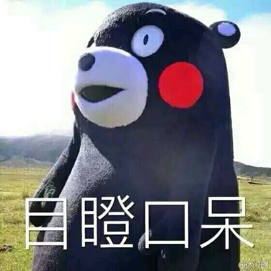

熊本熊（日语：くまモン，英语：Kumamon，官方中文名：酷MA萌）是日本熊本县营业部长兼幸福部长、熊本县地方吉祥物。

熊本熊最初设计目的是以吉祥物的身份，为熊本县带来更多的观光以及其他附加收入，并在2011年被授予熊本县营业部长兼幸福部长，成为日本第一位吉祥物公务员。

在振兴熊本县经济、宣传熊本县名气的同时，熊本熊依靠自身呆萌的形象、独特的授权运营方式，在日本本国及本国以外获得了超乎想象的欢迎，成为在世界上拥有极高人气的吉祥物。

为了突出本县特色，熊本熊在身体上使用了熊本城的主色调黑色，并在两颊使用了萌系形象经常采用的腮红，而红色也蕴含了熊本县“火之国”的称号，它不仅代表了熊本县的火山地理，更代表了众多美味的红色食物。

熊本熊的个头和真熊一样大小，使用真人扮演，第一代熊本熊皮套却长相怪异，看了可能会让人做噩梦。于是，小山薰堂请一家专制吉祥物皮套的工厂改进皮套，因此有了第二代皮套。而如今我们看到的是更加肥大呆萌的第三代皮套。

熊本熊的动作行为同样也是经过设计的。它的每次挥手、每个动作也都在计划内，包括最知名的“捂嘴”动作都被证明会令人感到可爱。而经常使用的抬脚动作，则来自另一个卡通前辈米老鼠。当一人高的熊本熊稍微歪头、双手捂住嘴巴开始卖萌时，很快就收获了孩子和姑娘们的尖叫，他们喊着“卡哇伊”，然后转头把这些形容词配着图片发到Twitter上。如果有人在生日当天@熊本熊，向它求祝福，通常都能收到萌熊的回应，这又掀起一轮话题的炫耀传播。

熊本熊为连许多日本民众都对她没有印象的熊本县带来可观经济效益，包括观光和产品销售，成为一个备受关注的营销研究个案。

熊本熊的成功，是吉祥物创作者与地方政府，以及幕后工作人员亲密配合的完美成果。设计师从Logo到吉祥物的奇思妙想，再到提出极富远见的营销建议，县政府都没有唱反调，反倒支持这种创新。而县政府在熊本熊的营销活动中，也一改以往一贯严肃的政府形象，变得亲民且幽默。蒲岛郁夫知事甚至为此出书，详细阐述了熊本熊营销成功的心得。而浓缩为书中的一句话就是“提拔吉祥物做营业部长，这是勇于‘打破盘子’的创新精神”。

